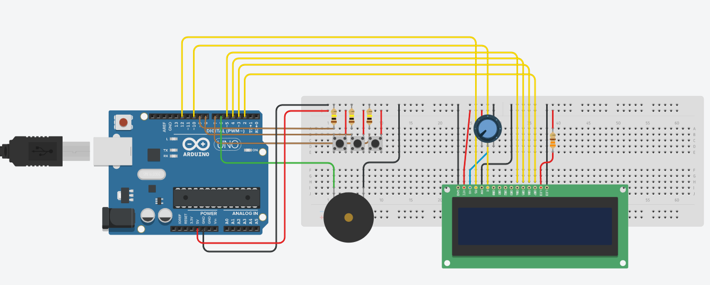
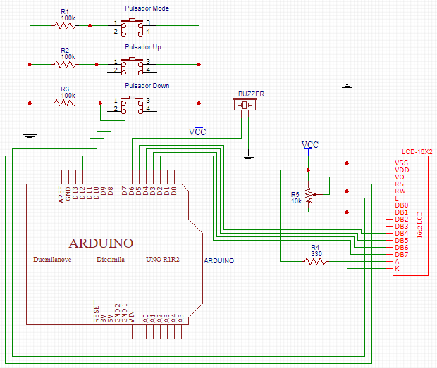

# Reloj Digital

Proyecto final del curso de Robotica - Ing. de Sistemas UNPRG

## Funcionalidades

- Reloj Digital
- Alarma

## Librerías Utilizadas

  - [LiquidCrystal](https://www.arduino.cc/en/Reference/LiquidCrystal)
  - [TimerOne](https://github.com/PaulStoffregen/TimerOne)
  
## Circuito 
  ### Diagrama de [Simulacion](https://www.tinkercad.com/things/7OMYABQKCYe)
  
  
  
  ### Circuito Esquematico
  
  
  
  ### Listado de Materiales

  - Arduino Uno
  - LCD 16x2
  - Buzzer
  - 3 Pulsadores
  - 3 Resistencias de 100K
  - 1 Resistencia de 330
  - 1 Potenciometro 10K
  
## Codigo

Incluir librerías

```ino
#include <TimerOne.h>
#include <LiquidCrystal.h>
```

Instanciar LiquidCrystal con los pines

```ino
LiquidCrystal lcd(12, 10, 5, 4, 3, 2);
```

Declarar las constantes de los Pulsadores y Buzzer

```ino
const int PULSADOR_MODO = 9;
const int PULSADOR_UP = 8;
const int PULSADOR_DOWN = 7;
const int BUZZER = 6;
```

Inicializamos las variables
Puedes saber más sobre variables volatiles [Aqui](https://www.arduino.cc/reference/en/language/variables/variable-scope--qualifiers/volatile/)

```ino
int horas=0;
int minutos=0;
volatile int segundos=0;
volatile boolean actualizar=true;

int horas_alarma=0;
int minutos_alarma=0;
boolean alarmaOn=false;
int contador_alarma=0;
```

El arreglo  texto, me permite crear un arreglo para darle un formato a la hora mostrada
La variable modo me permite manejar los distintos modos que  tendremos:
  - Modo '0' : Nos muestra la hora solamente
  - Modo '1' : Configuraremos la hora
  - Modo '2' : Configuramos los minutos
  - Modo '3' : Configuramos la hora de la alarma
  - Modo '4' : Configuramos los minutos de la alarma
  - Modo '5' : Activamos o desactivamos la alarma
La constante N nos indica los modos que tenemos (6 modos)

```ino
char texto[10];
int modo = 0;
const int N=6;
```

La función setup configura el LCD, los pines y el TimerOne

```ino
void setup(){
  //Incializamos el lcd y limpiamoz la pantalla
  lcd.begin(16,2);
  lcd.clear();

  //Colocamos los pulsadores como entrada y el buzzer como salida
  pinMode(PULSADOR_MODO, INPUT);
  pinMode(PULSADOR_UP, INPUT);
  pinMode(PULSADOR_DOWN, INPUT);
  pinMode(BUZZER, OUTPUT);

  //Con la libreria TimerOne inicializamos que se ejecute una funcion cada segundo
  //La función a realizar es manejadoraTimer
  Timer1.initialize(1000000);
  Timer1.attachInterrupt(manejadoraTimer);
}
```

La funcion manejadorTimer se ejecuta cada segundo

```ino
void manejadoraTimer(){
    segundos++;                     //aumenta los segundos
    if(digitalRead(BUZZER)==HIGH){
      contador_alarma++;            //Si la alarma está activa incrementa los segundos que pasan
    }
    actualizar=true;                
}
```

La funcion actualizarRejo aumentar los segundos minutos y horas.

```ino
void actualizarReloj(){
  minutos += segundos / 60; 
  segundos = segundos % 60;

  horas += minutos / 60;
  minutos = minutos % 60;

  horas = horas % 24;
}
```

La funcion incrementar, incrementa las horas y/o minutos

```ino
int incrementar(char tipo, int num){
  num++;
  num = tipo=='h'? num%24 : num%60;
  actualizar = true;
  return num;  
}
```

La funcion decrementar, disminuye las horas y/o minutos

```ino
int decrementar(char tipo, int num){
  num--;
  if(num<0){
    num = tipo=='h'? 23 : 59;
  }
  actualizar = true;
  return num;  
}
```

La funcion fijarCursor, posiciona el cursor y lo hace parpadear segun el modo

```ino
void fijarCursorModo(){
  switch(modo){
    case 0: 
      lcd.noBlink();
    break;
    case 1: 
      lcd.setCursor(4, 0);
      lcd.blink();
    break;
    case 2: 
      lcd.setCursor(7, 0);
      lcd.blink();
    break;
    case 3: 
      lcd.setCursor(4, 1);
      lcd.blink();
    break;  
    case 4: 
      lcd.setCursor(7, 1);
      lcd.blink();
    break;
    case 5:
      lcd.setCursor(10, 1);
      lcd.blink();
    break;
  }
}
```

Cada ves que se pulsa el pulsador de Modo, se incrementa, con el limite de los modos definidos

```ino
if(digitalRead(PULSADOR_MODO)==HIGH){
  modo++;
  modo = modo % N;
  fijarCursorModo();
  while(digitalRead(PULSADOR_MODO)==HIGH);
}
```

En el caso la alarma este sonando, al presionar cualquier pulsador se desactivaría

```ino
  if((digitalRead(PULSADOR_MODO)==HIGH) || (digitalRead(PULSADOR_UP)==HIGH) || (digitalRead(PULSADOR_DOWN)==HIGH)){
    if(digitalRead(BUZZER)==HIGH){
      digitalWrite(BUZZER, LOW);
      contador_alarma=0;  
    }
    while((digitalRead(PULSADOR_MODO)==HIGH) || (digitalRead(PULSADOR_UP)==HIGH) || (digitalRead(PULSADOR_DOWN)==HIGH));
  }
```

Según el modo en el que se encuentre, existen funciones para los otros pulsadores
 - En los 4 primeros modos:
   - ***El pulsador Up***: me permite incrementar minutos u horas, para lo cual se llama a la función incrementar
   - ***El pulsador Down***: me permite decrementar minutos u horas, para lo cual se llama a la función decrementar
 - En el caso 5:
   - ***El pulsador Up***: me permite Apagar/Encender la alarma
   - ***El pulsador Down*** queda inutilizable
    
```ino
switch(modo){
    //RELOJ
    case 1: 
      if(digitalRead(PULSADOR_UP)==HIGH){
        horas = incrementar('h',horas);
        while(digitalRead(PULSADOR_UP)==HIGH);
      }
      if(digitalRead(PULSADOR_DOWN)==HIGH){
        horas = decrementar('h',horas);
        while(digitalRead(PULSADOR_DOWN)==HIGH);
      }
    break;
    case 2: 
    if(digitalRead(PULSADOR_UP)==HIGH){
        minutos = incrementar('m',minutos);
        while(digitalRead(PULSADOR_UP)==HIGH);
      }
      if(digitalRead(PULSADOR_DOWN)==HIGH){
        minutos = decrementar('m',minutos);
        while(digitalRead(PULSADOR_DOWN)==HIGH);
      }
    break;
    //ALARMA
    case 3: 
      if(digitalRead(PULSADOR_UP)==HIGH){
        horas_alarma = incrementar('h',horas_alarma);
        while(digitalRead(PULSADOR_UP)==HIGH);
      }
      if(digitalRead(PULSADOR_DOWN)==HIGH){
        horas_alarma = decrementar('h',horas_alarma);
        while(digitalRead(PULSADOR_DOWN)==HIGH);
      }
    break;
    case 4: 
      if(digitalRead(PULSADOR_UP)==HIGH){
        minutos_alarma = incrementar('m',minutos_alarma);
        while(digitalRead(PULSADOR_UP)==HIGH);
      }
      if(digitalRead(PULSADOR_DOWN)==HIGH){
        minutos_alarma = decrementar('m',minutos_alarma);
        while(digitalRead(PULSADOR_DOWN)==HIGH);
      }
    break;
    case 5:    
      if(digitalRead(PULSADOR_UP)==HIGH){
        alarmaOn=!alarmaOn;
        actualizar=true;
        while(digitalRead(PULSADOR_UP)==HIGH);
      }
    break;
  }
```

En cada actualización se muestra por el LCD la hora actual y la alarma programada

```ino
if(actualizar == true){
    actualizarReloj();
    lcd.clear();
    lcd.noBlink();
    //RELOJ
    lcd.setCursor(4,0);
    sprintf(texto, "%02d:%02d:%02d",horas,minutos, segundos); 
    lcd.print(texto);
    lcd.setCursor(4,1);
    sprintf(texto, "%02d:%02d",horas_alarma,minutos_alarma); 
    lcd.print(texto);
    String estado_alarma = alarmaOn? " ON" : " OFF";
    lcd.print(estado_alarma);
    /*
      Si la alarma se encuentra activada 
        Verifica si las horas y minutos actuales coinciden con las programadas
        De ser las mismas, aciva la alarma
      Compara el contador de la alarma, si es igual a 60 
      Recordar que el contador solo aumenta si la alarma está sonando, de lo contrario se encontraría en 0.
      Si el contador es igual, dejaría de sonar la alarma y el contador se reinicia en 0;
    */
    if(alarmaOn ==true){
      if(segundos==0 && horas == horas_alarma && minutos == minutos_alarma){
        digitalWrite(BUZZER, HIGH);
      }
    }        
    if(contador_alarma==60){
      digitalWrite(BUZZER, LOW);
      contador_alarma=0;
    }  
    actualizar = false;
    fijarCursorModo();
  }  
}
```

La funcion sprintf me permite indicar el formato de una cadena de caracteres

```ino
sprintf(texto, "%02d:%02d",horas_alarma,minutos_alarma); 
```

En la variable texto me almacena el formato 'HH:MM:SS'
  - %d Indica que en esa parte va un valor númerico.
  - %2d Formatea el número a 2 digitos 
  - %02d Sí el número tiene 1 digito, le antepone un cero
  
Una ves dado el formato se colocan las variables. En el presente ejemplo: horas_alarma y minutos_alarma 


